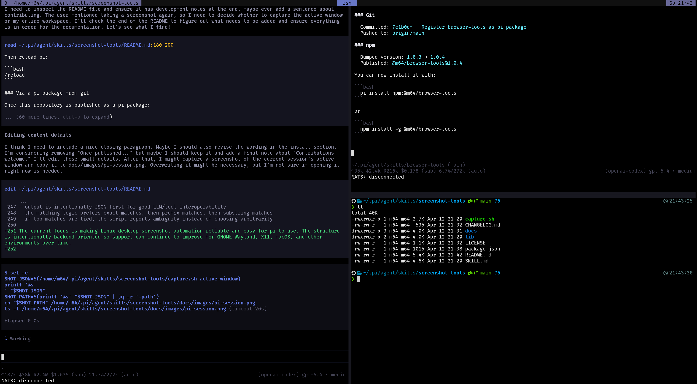

# pi-screenshot-tools

A **pi package** that bundles both:

- a cross-desktop screenshot **skill**
- an inline screenshot display **extension**

This package gives pi a stable screenshot backend plus user-facing commands/tools for displaying captures inline in supported terminals such as **Kitty**.



## Included resources

### Skill: `screenshot-tools`

Provides:

- full-screen capture
- active-window capture
- visible-window-by-name capture
- visible-window-by-id capture
- output/monitor capture
- workspace capture
- interactive region capture
- window/output/workspace listing

The backend lives in:

- `skills/screenshot-tools/capture.sh`
- `skills/screenshot-tools/lib/*`

### Extension: `screenshot-inline`

Provides:

- tool: `capture_screenshot`
- command: `/screenshot`
- command: `/screenshot-icat`
- command: `/screenshot-debug`

## Terminal behavior

### Outside tmux

`/screenshot` can use pi's TUI image rendering path.

### Inside tmux

Pi's TUI image rendering may not display reliably even when Kitty graphics passthrough works.
For that case, this package includes:

- `/screenshot-icat`

which displays the captured image through:

- `kitten icat --stdin=no`

This is the recommended fallback inside tmux.

## Installation

### From a local path

```bash
pi install /absolute/path/to/pi-screenshot-tools
```

### From git

```bash
pi install git:github.com/M64GitHub/pi-screenshot-tools
```

### From npm

```bash
pi install npm:@m64/pi-screenshot-tools
```

Then reload pi:

```text
/reload
```

## Usage examples

### Natural language

- `Take a screenshot of the active window`
- `Take a screenshot of the current workspace`
- `Take a screenshot of the kitty window`
- `Capture window id 229`
- `List windows I can capture`

On Sway and Hyprland, named/id window capture is screen-region based and may briefly switch to the target workspace to make an off-workspace window visible before capturing and returning.

### Slash commands

```text
/screenshot
/screenshot active-window
/screenshot window kitty
/screenshot window-id 229
/screenshot list-windows
/screenshot-icat active-window
/screenshot-debug message
```

## Package layout

```text
pi-screenshot-tools/
├── package.json
├── README.md
├── extensions/
│   └── screenshot-inline/
│       ├── index.ts
│       └── README.md
└── skills/
    └── screenshot-tools/
        ├── SKILL.md
        ├── README.md
        ├── capture.sh
        ├── lib/
        └── docs/
```

## Development notes

The extension resolves the screenshot backend in this order:

1. package-local `skills/screenshot-tools/capture.sh`
2. fallback to `~/.pi/agent/skills/screenshot-tools/capture.sh`

That makes the package usable both:

- as a bundled pi package
- and in your current local global-agent setup

## License

MIT
